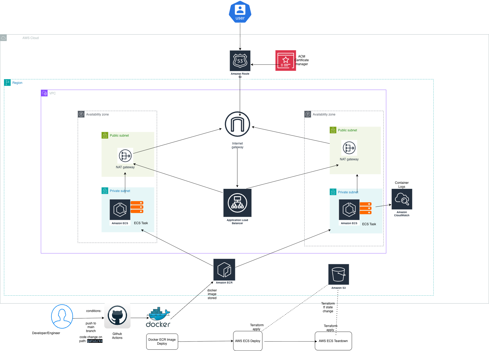
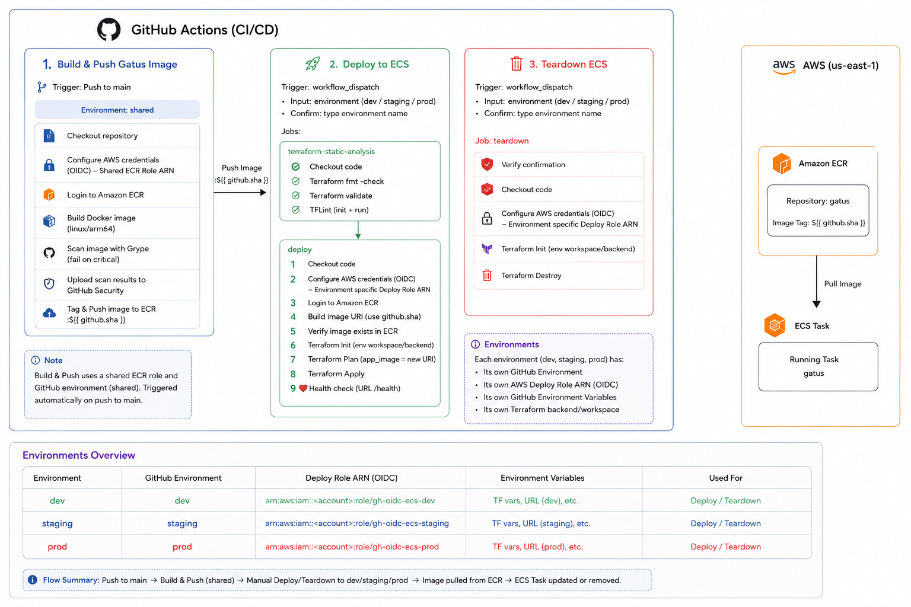
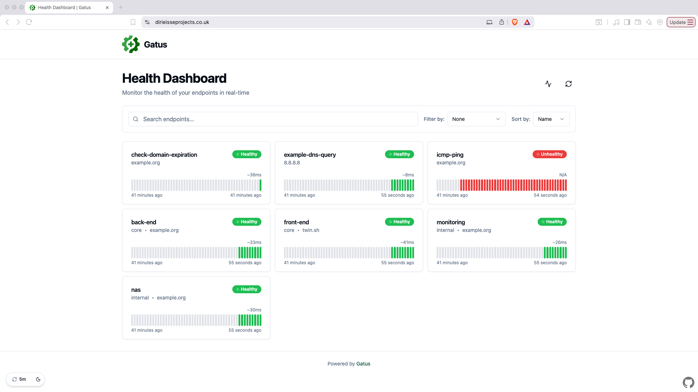
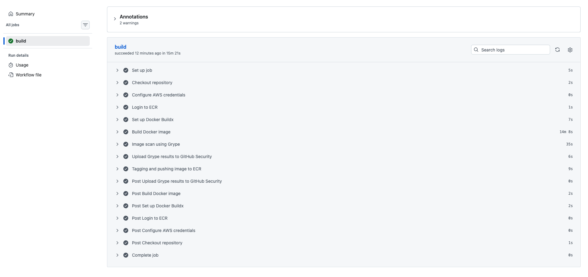
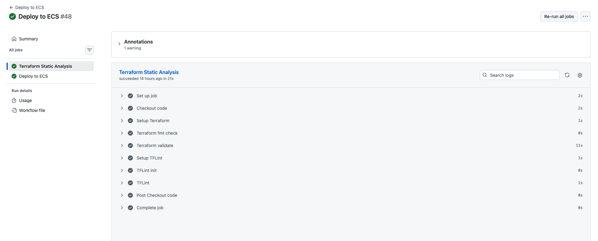
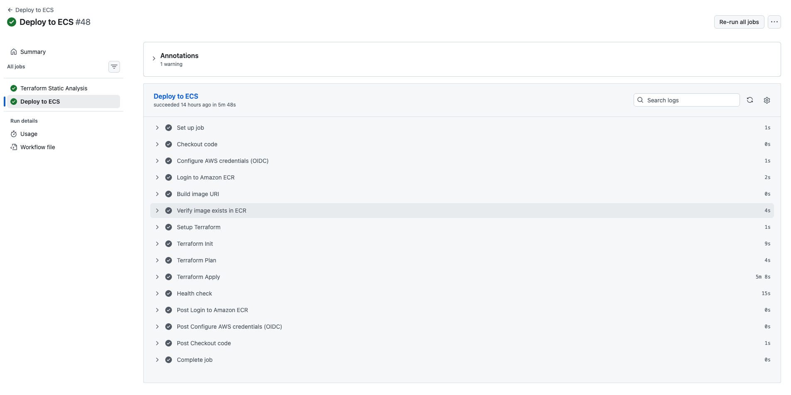
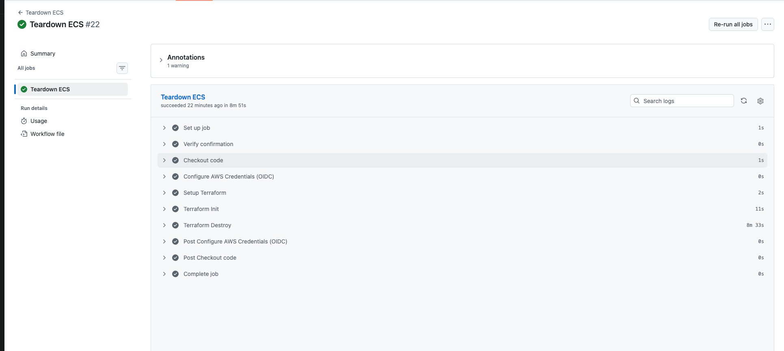

# ecs-project-v1

Infrastructure-as-code and CI/CD for deploying **[Gatus](https://gatus.io)** (a health/uptime
dashboard) to **AWS ECS Fargate** across `dev`, `staging`, and `prod`.

Everything is driven by **Terraform** (AWS infrastructure) and **GitHub Actions** (image build +
deploys). Authentication to AWS uses **GitHub OIDC** — no long-lived AWS keys are stored in the repo.

---

## AWS Architecture



## CICD Architecture



---

## Repository layout

```
.
├── gatus/                     # Vendored Gatus app — we own only the Dockerfile + config.yaml
├── terraform/
│   ├── bootstrap-state/       # Layer 0: S3 bucket that stores bootstrap state (local backend)
│   ├── bootstrap/             # Layer 1: OIDC, ECR, per-env state buckets, deploy roles
│   ├── environments/          # Layer 2: per-environment infrastructure (dev / staging / prod)
│   └── modules/               # Reusable modules (vpc, alb, ecs, iam, acm, route_53, cloudwatch…)
└── .github/workflows/         # docker-build, ecs-deploy, ecs-teardown
```

---

## The application container (`gatus/`)

A vendored copy of upstream [Gatus](https://github.com/TwiN/gatus); we maintain only the `Dockerfile`
and `config.yaml`.

- **Multi-stage build:** `golang:1.26-alpine` compiles a static ARM64 binary (`CGO_ENABLED=0`), copied
  into `gcr.io/distroless/static-debian13:nonroot` → minimal attack surface, non-root, no shell.
- Exposes port `8080` (matches the ALB target group and ECS security group).
- `config.yaml` defines the monitored endpoints. It ships with placeholder URLs and should be edited
  to point at real services.

---

## Networking & security groups

Two chained security groups: the internet reaches the ALB, and *only* the ALB reaches the tasks.

```
Internet ──▶ [ ALB SG ] ──▶ [ ECS SG ] ──▶ ECS task (:8080)
             80 / 443        8080 from
             from anywhere   ALB SG only
```

- **ALB** in public subnets (inbound via Internet Gateway); **ECS tasks** in private subnets
  (outbound only, via NAT).
- The ECS ingress rule references the ALB security group as its source (not a CIDR), so tasks stay
  unreachable from anywhere except the load balancer.

---

## GitHub Actions workflows

All three authenticate to AWS via **OIDC** and assume a role created by the bootstrap layer.

- **`docker-build.yaml`** (push to `main`, `shared` env): build `linux/arm64` image → scan with
  **Grype** (fails on `critical`, uploads SARIF to the Security tab) → push to ECR as `gatus:<git-sha>`.

- **`ecs-deploy.yaml`** (manual `workflow_dispatch`): Terraform static analysis (`fmt`, `validate`,
  TFLint; a Checkov step is currently commented out) → verify the image exists in ECR → `terraform
  init/plan/apply` with `-var="app_image=<uri>"` → post-deploy health check on `/health`.

- **`ecs-teardown.yaml`** (manual): aborts unless `confirm` exactly matches the environment name →
  `terraform destroy`.

Deploy and teardown use a concurrency group keyed on environment + ref so runs can't overlap.

---

## Key design decisions

- **Trunk-based, deploy is manual.** Every push to `main` builds an immutable, SHA-tagged image
  (`gatus:<git-sha>`) in ECR. Deploys are a separate `workflow_dispatch` — you choose which commit's
  image goes to which environment, and when. The deploy refuses to run unless the image already exists.

- **Least-privilege OIDC identities.** A `shared` GitHub environment owns an ECR-only push role
  (image builds are environment-agnostic). Each of `dev`/`staging`/`prod` has its own deploy role,
  trust-scoped to `repo:<repo>:environment:<env>` — so a dev run physically cannot obtain prod
  credentials. Deploy and teardown share the per-environment role; the guardrail on teardown is a
  typed confirmation that must equal the environment name.

- **Environment directories, not workspaces.** `dev`/`staging`/`prod` are separate root modules,
  each with its own state bucket (`gatus-terraform-state-<env>`). The environment is visible in the
  path and backend, isolated per state, and safe to diverge — at the cost of near-duplicate roots
  (shared logic lives in `terraform/modules/*`).

- **Layered bootstrap.** Three layers applied in order —
  `bootstrap-state` (local backend, creates the state bucket) → `bootstrap` (OIDC, ECR, per-env state
  buckets, roles) → `environments/*` — solving the "where does the state bucket's state live?"
  chicken-and-egg and separating rarely-changed plumbing from app infrastructure.

- **Single account.** Isolation is via IAM/OIDC boundaries and separate state buckets rather than
  separate accounts (multi-account is listed under improvements).

Provider `hashicorp/aws` `6.50.0`, Terraform `~> 1.14.9`.

---

## Terraform modules

### Bootstrap modules (`terraform/bootstrap/modules/`)

The `bootstrap` root is thin — it wires together five single-responsibility modules, using `for_each`
over `var.environments` for the two per-environment ones.

| Module | Instantiated | Responsibility |
|--------|--------------|----------------|
| `oidc` | once | The GitHub Actions **OIDC identity provider** (`token.actions.githubusercontent.com`, audience `sts.amazonaws.com`). Its ARN is passed into both role modules so they can be assumed with no static keys. |
| `ecr` | once | The **ECR repository** (`gatus`) with `scan_on_push = true` and a lifecycle rule keeping the last 10 images (tag mutability currently `MUTABLE`). |
| `s3` | per env | One **remote-state bucket per env** (`gatus-terraform-state-<env>`) — versioned, AES256-encrypted, full public-access block, `prevent_destroy`. |
| `deployment-role` | per env | The **per-environment deploy role**, trust-scoped to `repo:<repo>:environment:<env>`. Policy has three statements: `AppServices` (broad `ecs/ecr/elb/acm/ec2/logs/route53` on `*`), `PassRoleScoped` (only the two ECS task roles for its env), `StateBackend` (its state bucket + bootstrap state). |
| `ecr-deployment-role` | once | The **ECR push role**, trust-scoped to `environment:shared` — `ecr:GetAuthorizationToken` on `*` plus push/pull scoped to just the `gatus` repo ARN. |

### Deployment modules (`terraform/modules/`)

The reusable building blocks each `environments/*` root wires together.

| Module | Responsibility |
|--------|-----------------|
| `vpc` | VPC (DNS enabled), public + private subnets (`for_each`), Internet Gateway, one NAT gateway + EIP per public subnet, route tables. |
| `security_groups` | **ALB SG** (ingress 80/443 from anywhere) and **ECS SG** (ingress 8080 *only* from the ALB SG). |
| `iam` | ECS **task execution role** (AWS-managed `AmazonECSTaskExecutionRolePolicy`) and **task role**, trusting `ecs-tasks.amazonaws.com`. |
| `route_53` | Public **hosted zone** for the domain + name-server registration. |
| `acm` | **ACM certificate** with DNS validation (creates the record, waits for validation). |
| `route_53_records` | **A/alias record** pointing the domain at the ALB. |
| `alb` | ALB, target group (`ip` type, health check `/health:8080`), HTTP:80→HTTPS:301 redirect listener, HTTPS:443 forwarding listener with the ACM cert. |
| `cloudwatch` | Log group `/{project}/{env}/app` with 30-day retention. |
| `ecs` | Fargate **cluster**, **task definition** (ARM64), and **service** (private subnets, registered with the ALB target group). |

---

## GitHub Environment Setup

Four GitHub Environments are required: `shared` (image builds) and one each for `dev`, `staging`,
`prod` (deploys/teardowns). Create them under **Settings → Environments**, then populate each with
the secrets/variables below, sourced from the `bootstrap` layer's outputs (roles/ARNs) and your own
per-environment config (domains, sizing, CIDRs).

#### `shared` — used by `docker-build.yaml`

| Kind | Name | Value |
|------|------|-------|
| Secret | `AWS_DEPLOY_ECR_ROLE_ARN` | ECR push role ARN (from `bootstrap` output) — OIDC, push/pull only |
| Variable | `AWS_REGION` | `us-east-1` |
| Variable | `ECR_REPOSITORY` | `gatus` |

#### `dev` / `staging` / `prod` — used by `ecs-deploy.yaml` & `ecs-teardown.yaml`

| Kind | Name | Value |
|------|------|-------|
| **Secret** | `AWS_DEPLOY_ROLE_ARN` | This environment's deploy role ARN (from `bootstrap` output) — **different per environment**, OIDC trust scoped to `repo:<repo>:environment:<env>` |
| Variable | `ECR_REPOSITORY` | `gatus` |
| Variable | `URL` | Public hostname for the post-deploy health check |
| Variable | `TF_VAR_AWS_REGION` | `us-east-1` |
| Variable | `TF_VAR_ENVIRONMENT` | `dev` / `staging` / `prod` |
| Variable | `TF_VAR_PROJECT_NAME` | `gatus` |
| Variable | `TF_VAR_DOMAIN_NAME` | Domain managed by Route 53 / covered by ACM |
| Variable | `TF_VAR_COMMON_TAGS` | Common resource tags, e.g. `{"Environment":"dev","Project":"gatus","ManagedBy":"terraform"}` |
| Variable | `TF_VAR_VPC_CONFIG` | VPC CIDR + name, e.g. `{"cidr_block":"10.0.0.0/22","name":"dev-vpc"}` |
| Variable | `TF_VAR_PUBLIC_SUBNET_CONFIG` | Public subnet CIDRs / AZs |
| Variable | `TF_VAR_PRIVATE_SUBNET_CONFIG` | Private subnet CIDRs / AZs (+ NAT mapping) |
| Variable | `TF_VAR_TASK_CPU` | Fargate task CPU, e.g. `256` |
| Variable | `TF_VAR_TASK_MEMORY` | Fargate task memory, e.g. `512` |
| Variable | `TF_VAR_APP_PORT` | Container port — `8080` |
| Variable | `TF_VAR_APP_COUNT` | Desired ECS task count |

> Per-environment `terraform.tfvars` files are git-ignored. Locally, populate them by hand; in CI,
> these `TF_VAR_*` GitHub variables supply the same values automatically.

---

## Running it (replication)

**1. Bootstrap AWS (local, one-time, in order):**

```bash
cd terraform/bootstrap-state && terraform init && terraform apply   # creates the bootstrap state bucket
cd ../bootstrap             && terraform init && terraform apply   # OIDC, ECR, per-env state buckets, deploy roles
```

**2. Configure GitHub:** create the `shared`, `dev`, `staging`, `prod` environments and populate them
per the [GitHub Environment Setup](#github-environment-setup) tables above, using the role ARNs and
resource names output by step 1.

**3. Deploy:**

```
push to main            → docker-build.yaml builds, scans, pushes gatus:<sha> to ECR
run "Deploy to ECS"      → static analysis → terraform apply with app_image=gatus:<sha>
                         → health check confirms https://<URL>/health is live
```

**4. Tear down:** run "Teardown ECS", typing the environment name to confirm.

---
Deployment screenshots 






---

## Cost notes

Resources are tagged with `Project` / `Environment` / `ManagedBy` (common) plus per-resource `Name`
and `Service`. Activate `Environment` and `Service` as cost allocation tags, then group by them in
Cost Explorer to split spend per environment and per component. The dominant cost driver for this
architecture is the **NAT gateways** (billed per-hour and per-GB), followed by the ALB and Fargate.

---

## Possible improvements

Deliberate simplifications with a clear upgrade path, roughly in priority order:

1. **Narrow the deploy role.** Its `AppServices` statement uses service-level `*` (`ecs:*`, `ec2:*`,
   …); IAM and S3 are already tightly scoped. Enumerate the real actions (e.g. via IAM Access
   Analyzer from CloudTrail) and scope resources to `gatus-<env>-*`.
2. **PRs + branch protection.** Require pull requests and green checks before code reaches `main`;
   run validation on `pull_request`, keep build-and-push on merge.
3. **Multi-account isolation** — separate AWS accounts per environment for a true account boundary.
4. **Smaller items:** re-enable Checkov and implement the changes.
